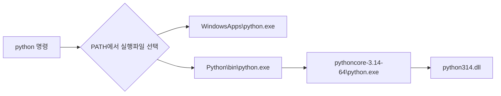

## 모듈과 패키지는 무엇인가?

함수들이 뭉쳐진 하나의 **.확장자** 파일 안에 이루어진 것을 모듈

이 모듈이 합쳐진 것이 패키지 (패키지는 종종 라이브러리라고 불리기도 함)  

모듈은 주로 import로 가져오는 형태

## 파이썬의 모듈 알아보기 (random, sys)

```python
#random 모듈 가져오는 예시
import random 

random.py 접근
```
<br>

```python
#random 모듈이 저장된 위치를 보는 방법
import random

print(random.__file__)

-> random.py가 저장된 폴더 출력
```
random.py안을 보면 _random을 import하는 것을 볼 수 있었음

이는 C로 작성되고 컴파일된 모듈을 가져온것 

<br>

```python
#random 모듈이 저장된 위치를 보는 방법
import sys

print(sys.__file__)

-> 이는 오류가 발생했음
```
sys 자체는 c로 되어있는 모듈이며 이는 python.exe를 만들때 사용되었므로 현재 저장되어있지 않았음

c 파일을 보고 싶다면 깃에서 가져오는 방법 (git clone https://github.com/python/cpython.git) 이 있음

## 실제 파이썬을 실행하면 어떻게 흘러가는지

where.exe python을 했더니 결과 주소가 2개가 나옴

C:\Users\user\AppData\Local\Microsoft\WindowsApps\python.exe  
-> Windows의 App Execution Alias. 실제 CPython 본체라기보다는, python 명령을 받았을 때 설치된 Python으로 연결해줌

C:\Users\user\AppData\Local\Python\bin\python.exe  
-> 실제 Python 설치 대상으로 연결해줌 (얘도 파이썬을 실행시키는 파일이 아님), Python을 찾아 실행해주는 관리용 프로그램

```
현재 내 폴더의 구조
C:\Users\user\AppData\Local\Python\
│
├── bin\
│   ├── python.exe
│   ├── python3.exe
│   ├── python3.14.exe
│   ├── pip.exe
│   └── ...
│
└── pythoncore-3.14-64\
    ├── python.exe
    ├── Lib\
    │   └── random.py
    ├── python314.dll
    └── ...
```
파이썬 실행 시


## Alias의 동작 방식


## import 하나로 모듈을 가져올 수 있는 방법

```python
#import시 파이썬 내에서 찾는 경로들
import sys

print(sys.path)
```
언어별 모듈 검색 위치에서 코드를 찾아서 가져오는 형태 (검색 규칙이나 저장 위치는 언어마다 다름)

## 라이브러리와 프레임워크는 어떻게 다른가?


## Python의 `.py`, Java의 `.class`, JAR는 각각 어떤 단위인가?


## Python `import`, Node.js `require`와 `import ... from`, Java `import`는 각 언어에서 무슨 역할을 하는가?

## 프로그램은 필요한 모듈이나 클래스를 어디서 찾는가?

## Python `sys.path`, Java `classpath`, Node.js `node_modules`는 어떻게 관련되는가?

## 상대 경로와 절대 경로 import는 어떻게 해석되는가?