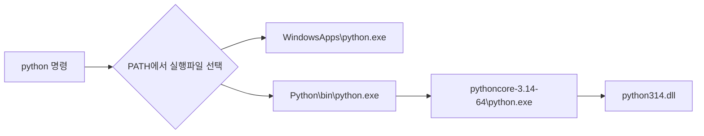

## 모듈과 패키지는 무엇인가?

함수들이 뭉쳐진 하나의 **.확장자** 파일 안에 이루어진 것을 모듈

이 모듈이 합쳐진 것이 패키지 (패키지는 종종 라이브러리라고 불리기도 함)

하지만 주로 패키지와 모듈이 합쳐진 것을 라이브러리라고 함

모듈은 주로 import로 가져오는 형태

## 파이썬의 모듈 알아보기 (random, sys)

```python
#random 모듈 가져오는 예시
import random 

random.py 접근
```
<br>

```python
#random 모듈이 저장된 위치를 보는 방법
import random

print(random.__file__)

-> random.py가 저장된 폴더 출력
```
random.py안을 보면 _random을 import하는 것을 볼 수 있었음

이는 C로 작성되고 컴파일된 모듈을 가져온것 

<br>

```python
#random 모듈이 저장된 위치를 보는 방법
import sys

print(sys.__file__)

-> 이는 오류가 발생했음
```
sys 자체는 c로 되어있는 모듈이며 이는 python.exe를 만들때 사용되었므로 현재 저장되어있지 않았음

c 파일을 보고 싶다면 깃에서 가져오는 방법 (git clone https://github.com/python/cpython.git) 이 있음

## 실제 파이썬을 실행하면 어떻게 흘러가는지

where.exe python을 했더니 결과 주소가 2개가 나옴

C:\Users\user\AppData\Local\Microsoft\WindowsApps\python.exe  
-> Windows의 App Execution Alias. 실제 CPython 본체라기보다는, python 명령을 받았을 때 설치된 Python으로 연결해줌

C:\Users\user\AppData\Local\Python\bin\python.exe  
-> 실제 Python 설치 대상으로 연결해줌 (얘도 파이썬을 실행시키는 파일이 아님), Python을 찾아 실행해주는 관리용 프로그램

```
현재 내 폴더의 구조
C:\Users\user\AppData\Local\Python\
│
├── bin\
│   ├── python.exe
│   ├── python3.exe
│   ├── python3.14.exe
│   ├── pip.exe
│   └── ...
│
└── pythoncore-3.14-64\
    ├── python.exe
    ├── Lib\
    │   └── random.py
    ├── python314.dll
    └── ...
```
파이썬 실행 시


## Alias의 동작 방식

Alias란 다른 이름으로 연결해둔 별칭

```zsh
alias

입력 시 mac 환경에서 alias를 확인 가능

which python

특정 alias를 확인하고 싶을 경우 사용 가능
```

실행 방법은 셸이 명령어를 실행하기 전에 문자열을 다른 문자열로 치환해줌

alias는 zsh에 저장되는 형태라 현재 셸 프로세스에 저장됨 (만약 끄면 초기화 됨)

영구적으로 alias를 사용하고 싶다면 ~/.zshrc에 적어야함 (vim으로 켜서 직접 입력 후 source ~/.zshrc)

~/.zshrc에는 환경변수와 alias가 모두 들어 있음

## 환경 변수

환경변수를 보기 위해서는 env로 볼 수 있음

하나의 환경변수에 대해 보고 싶으면 `echo $환경변수이름` 으로 확인 가능

환경 변수는 값을 저장해 프로그램들과 셸이 사용함

~/.zshrc에 `export 환경변수이름 = 값`으로 저장하면 자식까지 모두 접근 가능함


## 환경변수 PATH에 대해

명령어를 입력했을 때 실행 파일을 어디서 찾을지 적어둔 디렉토리 목록

실행파일을 찾을 폴더 목록이 나열되어 있음 (앞의 주소부터 먼저 찾아보고 넘어가는 형태)

셸이 명령어 검색에 사용하기도 함

## Brew에 대해

macOS용 프로그램 패키지 관리자

보통 /opt/homebrew에 저장되어 관리하는 형태

보통 python 기준, python 설치는 brew로 라이브러리 설치는 pip로 함 (brew 파일 밑에 설치됨)

pip로 설치하면 라이브러리 버전은 하나만 저장 가능함 (그래서 venv 같은 가상환경을 씀)

## venv에 대해

python에서 프로젝트마다 독립된 실행 환경을 만들어주는 도구

언어에 따라 가상환경은 서로 조금씩 다르지만 프로젝트마다 버전을 격리하려는 구조는 같음

```
.venv/
├── bin/
│   ├── python
│   ├── pip
│   └── activate
├── lib/
│   └── python3.x/
│       └── site-packages/
└── pyvenv.cfg
```

이런 구조로 생성됨 (PATH를 잠깐 바꿔서 .venv/bin을 가장 앞에 둬서 구현함)

기존에 설치된 python을 기반으로 만들어짐 (파이썬 버전이 미리 설치되어 있어야함), 그 기반으로 venv를 만듬

/bin에 실행 파일들이 존재, /lib에 라이브러리들이 저장됨

## 윈도우에서 WSL2를 사용하기

WSL2를 사용해 brew처럼 프로그램 패키징 관리를 할 수 있다고 함

WSL2를 이용해 apt, pyenv 같은 리눅스용 버전 관리 도구를 쓰는 것

WSL2를 이용해 가볍게 가상환경 커널을 돌리며 사용, 프로젝트는 리눅스 가상환경 안에 만드는 것이 성능이 좋음 (파일시스템이 느리기 때문)

혹은 가상환경을 쓰기 싫다면 winget을 사용하면 됨

## import 하나로 모듈을 가져올 수 있는 방법

```python
#import시 파이썬 내에서 찾는 경로들
import sys

print(sys.path)
```

언어별 모듈 검색 위치에서 코드를 찾아서 가져오는 형태 (검색 규칙이나 저장 위치는 언어마다 다름)

## 라이브러리와 프레임워크는 어떻게 다른가?

여러 패키지들의 모임을 라이브러리라고 함 (내 코드가 필요할 때 호출해서 사용)

프레임워크는 프로그램 전체 구조와 실행 흐름을 미리 정해놓고 코드를 안에 끼워 넣는 방식 (제어의 역전 IoC)

프레임워크는 라이브러리처럼 lib 파일 밑에 저장됨 (Java의 Maven, Gradle은 캐시)

## import 실행 과정

1. 먼저 불러온 적이 있는지 확인 : sys.modules(실행중인 파이썬 프로세스의 메모리안에 있음)을 봄 (보고 있다면 재사용)
2. 없으면 모듈 찾기 시작 : sys.meta_path를 사용(import 할 모듈을 어떤 방식으로 찾을지 정하는 파인더)
3. loader가 실제 파일을 읽음
4. 별도의 module 객체를 만듦
5. sys.modules에 캐싱

## 명령어 찾는 순서

1. Alias 확인
2. Shell funtion 확인 (zsh 안에 정의되어 있는지)
3. Shell builtin 확인 (zsh에 내장되어 있는지)
4. PATH에서 실행 파일 검색

